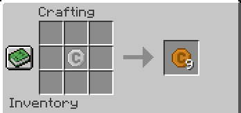
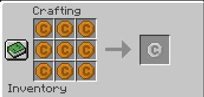
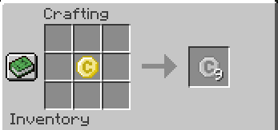
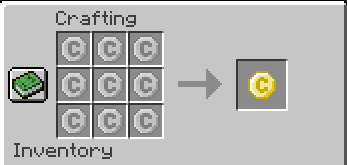

# Cogicoin Mod (v: 1.1.0)

El mod Cogicoin añade 4 tipos de monedas esteticas al juego: Cogicoin de Cobre, Cogicoin de Plata, Cogicoin de Oro y la Cogicum. Estas monedas solo tienen una funcionalidad estetica y de rol.

## Caracteristicas

* Añade 4 monedas al juego: 
    * Cogicoin de Cobre.
    * Cogicoin de Plata. 
    * Cogicoin de Oro.
    * Cogicum.
* Su unica funcionalidad es estetica y de rol.
* Se ha añadido un sistema de crafteo para convertir entre los diferentes tipos de monedas.
* Los mobs hostiles siempre dropear de 1 a 9 Cogicoins de Cobre al ser derrotados.
* Existe una baja probabilidad de que los mobs hostiles dropeen 1 Cogicoin de Plata al ser derrotados.

## Crafteos

* Crafteo de Cogicoin de Cobre:
    
* Crafteo de Cogicoin de Plata:
    
    
* Crafteo de Cogicoin de Oro:
    

## Instalacion
1. Descarga el archivo JAR del mod desde el siguiente [enlace de descarga](https://www.mediafire.com/file/5y4fp1jsm5dyp7z/cogicoin-1.1.0.jar/file).

2. Copia el archivo JAR descargado en la carpeta de mods de tu instalación de Minecraft.

3. Ejecuta el juego y disfruta del mod Cogicoin!

## Créditos
El mod Cogicoin fue creado por TheJunger / Peramods. Agradecemos a la comunidad de Minecraft por su apoyo y retroalimentación.

---

¡Esperamos que disfrutes del mod Cogicoin y que te diviertas!